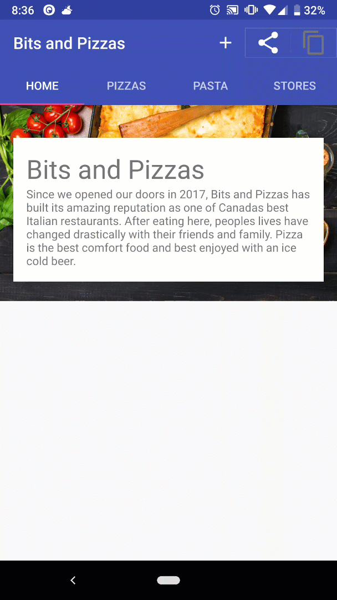

In this post, I’ll be adding features to the Bits and Pizzas app and implement them while writing out this blog as a way to teach myself for self reference. In this exercise, the Android Design Support Library is explored to give a seamless UI.

#### <center>**Adding the hiding Toolbar on Scroll**



The toolbar responds to the user scroll action and hides itself. It enables the user to see more content on the screen. In order to achieve this, a **CoordinatorLayout** is used which allow the views to be affected by a behaviour of another.

We need to mark the view the user will scroll and tell the toolbar to respond to it. The view pager will be the one that will marked using this attribute below:

```xml
    app:layout_behavior="@string/appbar_scrolling_view_behavior"
```

The toolbar will respond to it by using this attribute:

```xml
    app:layout_scrollFlags="scroll|enterAlways"
```

The scroll attribute allows the toolbar to scroll up and off the screen and the `enterAlways` will allow the toolbar to scroll quickly. The code layout pattern is shown below:

```xml
    <?xml version="1.0" encoding="utf-8"?>
    <android.support.design.widget.CoordinatorLayout
      ...>

       <android.support.design.widget.AppBarLayout
           ...>

           <android.support.v7.widget.Toolbar
               android:id="@+id/toolbar"
               android:layout_width="match_parent"
               android:layout_height="?attr/actionBarSize"
               app:layout_scrollFlags="scroll|enterAlways"/>

           <android.support.design.widget.TabLayout
               ... />

       </android.support.design.widget.AppBarLayout>


       <android.support.v4.view.ViewPager
           android:id="@+id/pager"
           android:layout_width="match_parent"
           android:layout_height="match_parent"
           app:layout_behavior="@string/appbar_scrolling_view_behavior"/>


    </android.support.design.widget.CoordinatorLayout>
```

In order for this to work, we needed the fragment to be scrollable. Therefore we added a nested scroll view in the TopFragment. The nested scroll view holds our picture and text using a Frame Layout which allows the styling to overlap.

```xml
    <?xml version="1.0" encoding="utf-8"?>
    <android.support.v4.widget.NestedScrollView xmlns:android="http://schemas.android.com/apk/res/android"
       xmlns:tools="http://schemas.android.com/tools"
       android:layout_width="match_parent"
       android:layout_height="match_parent"
       android:orientation="vertical"
       tools:context=".TopFragment">


       <FrameLayout
           android:layout_width="match_parent"
           android:layout_height="wrap_content">

           <ImageView android:id="@+id/info_image"
               android:layout_width="match_parent"
               android:layout_height="wrap_content"
               android:scaleType="centerCrop"
               android:src="@drawable/restaurant"
               android:contentDescription="@string/restaurant_image"/>

           <LinearLayout
               android:layout_width="match_parent"
               android:layout_height="wrap_content"
               android:layout_marginTop="40dp"
               android:layout_marginLeft="16dp"
               android:layout_marginRight="16dp"
               android:padding="16dp"
               android:background="#FFFFFF"
               android:orientation="vertical">

               <TextView
                   android:layout_width="match_parent"
                   android:layout_height="wrap_content"
                   android:textSize="32sp"
                   android:text="@string/company_name"/>

               <TextView
                   android:layout_width="match_parent"
                   android:layout_height="wrap_content"
                   android:text="@string/home_text"/>

           </LinearLayout>
       </FrameLayout>


    </android.support.v4.widget.NestedScrollView>
```

#### Adding the collapsing Toolbar to OrderActivity

This is a neat feature implemented in the Design Support Library. The variant of the toolbar interactions are seen below:

In order to achieve this effect, the structure of the layout would have to look like something below where the data is nested in the android support design widget.

```xml
    <android.support.design.widget.CoordinatorLayout xmlns:android="http://schemas.android.com/apk/res/android"
       ...>

     <android.support.design.widget.AppBarLayout
        ...>

         <android.support.design.widget.CollapsingToolbarLayout
             ..
             app:layout_scrollFlags="scroll|exitUntilCollapsed"
             app:contentScrim="?attr/colorPrimary">

             <ImageView
                 android:scaleType="centerCrop"
                 android:src="@drawable/restaurant"
                 android:contentDescription="@string/restaurant_image"
                 app:layout_collapseMode="parallax"/>


         <android.support.v7.widget.Toolbar
                 ..
                 android:layout_height="?attr/actionBarSize"
                 app:layout_collapseMode="pin" />

         </android.support.design.widget.CollapsingToolbarLayout>

     </android.support.design.widget.AppBarLayout>

       <android.support.v4.widget.NestedScrollView
             app:layout_behavior=”@string/appear_scrolling_view_behaviour”
       </android.support.v4.widget.NestedScrollView>


    </android.support.design.widget.CoordinatorLayout>
```

We need to use the CollapsingToolbarLayout element and nest the Toolbar widget inside of it. An image is also added with a parallax effect. As seen before, we need to mark the scrollable content with `app:@string/appbar_scrolling_view_behavior` and then add the flag attribute of `app:layout_scrollFlags="scroll|exitUntilCollapsed"` to let Android know that our CollapingToolbar will change depending on the scrollable content.

Lastly, we add `app:layout_collapseMode="pin"` which allows us to pin anything important in the toolbar, in this case, the Up button.
