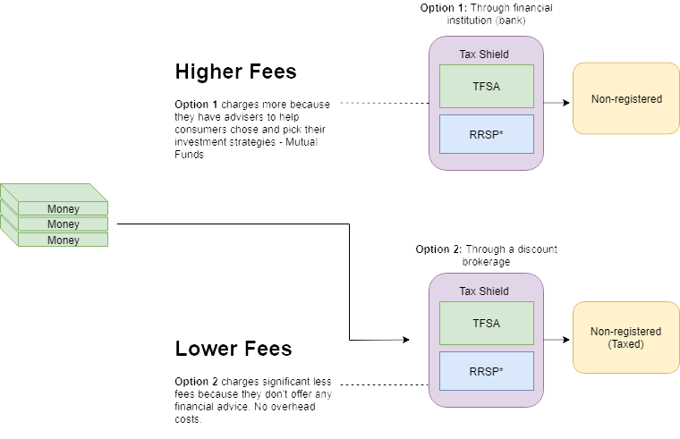

###**Getting started with Investing**

WTF is investing? Simply put, it’s to take your money and put it into financial systems, shares, property or any commercial venture with expectation of generating profit.

The idea is that your money is working for you, so when you’re sleeping you can still generate income. How awesome is that? My post will be an extremely high level summary of what investing entails and is not considered to be financial advice. Please do your own research, this is what I’ve learned so far. This post was inspired by [millennial-revolution’s ](https://www.millennial-revolution.com/freedom/how-i-built-a-seven-figure-portfolio-and-retired-at-31/)blog.

In Canada, you have several investing accounts you can open. But for my current needs and purposes, I will be talking about my [TFSA (Tax Free Savings)](https://www.advisor.ca/columnists_/michelle-munro/tfsas-and-non-registered-accounts/), [RRSP (Registered Retirement Savings Plan)](https://www.diffen.com/difference/RRSP_vs_TFSA) and my [DCPP (Defined contribution pension plan)](https://www.sunlife.ca/ca/Learn+and+Plan/Money/Retirement+savings/What+kind+of+company+pension+do+you+have?vgnLocale=en_CA).

But wait, if you're young and just starting work, why do you need to save up for retirement already? Well, the best way to retire early with fat stacks is to save a little now and learn all this crap early so that **_time _**is playing in **_your favour._**

If you have a full time job and it offers a pension plan DCPP or a DBPP from your employer, then you better figure out what the minimal contribution is to receive an employer match.

For example, if you agree to contribute 5% of your annual income to your work pension plan, then your company will promise to contribute 5% on top of your contribution making it 10% total. You get to keep this extra money from your employer. **This is literally free money**.

TFSAs are accounts designed to help you save. Any money you gain from it is tax-free. You can open these up at a bank, broker or an insurance company. Every year, the contribution amount increases by a fixed amount based on inflation. If your TFSA investments do well, you increase your total contribution room by the gained amount.

### **How do you make money from a TFSA?**

**Option 1 - The easy bank way:**

Banks have financial services you can go to and they could give you finanicial advice. However, they do take a fee from your investments because they have overhead costs and provide convenient services.

**Option 2 - The discount brokerage way:**

After reading John Bogle’s common sense to investing, he says the return is a generous 7-9.5% from the entire US market. In order to do this, you’d have to go through a discount brokerage to purchase index funds. There are less fees with a discount brokerage since they do not give you any financial advice.

This is more for the DIY kind of people. A few percentages saved from fees can mean the difference of a few thousand dollars in the long run.

The idea is that all your gains from investment be taxed free if possible\*. RRSP contributions are taxed after you retire. However, any initial investments in an RRSP are not taxed and reduces your taxable income by lowering your income bracket.

For example, a person making 50k a year, and contribute 5k to their RRSP. The employer reports to the government that the person is making 50k, but when tax papers come around and it will report the individual's income is 45k instead because 5k went to their retirement plan. Therefore, the government will send a refund for paying too much taxes or have a reduced tax payable. Best case scenario, you get a tax refund and use it to top off your TFSA.

My current goal is to shove as much money in my TFSA as I can to max it out. The earlier I have it maxed out, the more time it will have to grow. In my next post, I will break down my current TFSA holding and why I have those holdings.
